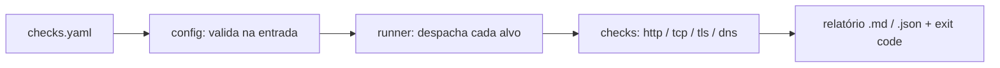

# infrawatch

[](https://github.com/ghsantos-software/infrawatch/actions/workflows/ci.yml)

CLI que verifica a saúde de uma infraestrutura a partir de um arquivo YAML e gera
um relatório. Feita para rodar em terminal, em pipeline de CI ou num agendamento.

## O que verifica

| `type` | Verificação |
|---|---|
| `http` | status HTTP esperado + latência |
| `tcp`  | a porta está aberta |
| `tls`  | dias até o certificado expirar |
| `dns`  | o host resolve, e para quais IPs |

## Exit codes

O contrato da ferramenta com `cron`, CI e monitoramento:

| Código | Significado |
|---|---|
| `0` | tudo saudável |
| `1` | um ou mais checks degradados |
| `2` | erro na configuração |

## Configuração — `checks.yaml`

```yaml
targets:
  - name: Site principal
    type: http
    url: https://example.com
    expect_status: 200        # opcional, padrão 200

  - name: Porta do banco
    type: tcp
    host: db.example.com
    port: 5432

  - name: Certificado do site
    type: tls
    host: example.com
    port: 443                 # opcional, padrão 443
    warn_days: 21             # opcional, padrão 30

  - name: DNS do site
    type: dns
    host: example.com
```

## Como usar

**Local:**

```bash
pip install -r requirements.txt
python -m infrawatch --config checks.yaml
```

Opções: `--out report.md` (salva em arquivo), `--format json`, `--help`.

**Docker** (o `checks.yaml` é montado, não vai na imagem):

```bash
docker build -t infrawatch .
docker run --rm -v ${PWD}/checks.yaml:/app/checks.yaml infrawatch
```

**Agendado (GitHub Actions):** o workflow [`scheduled.yml`](.github/workflows/scheduled.yml)
roda de 6 em 6 horas, publica o relatório no resumo da run, guarda como artefato e
**falha a run** (te notifica) se algo degradou. Dá pra disparar na hora pelo botão
*Run workflow*.

## Como funciona



## Desenvolvimento

```bash
pip install -r requirements-dev.txt
pytest
ruff check .
```

Os testes fingem a rede (`pytest-httpx`, TLDs reservados) — rápidos e sem depender de internet.

## Roadmap

- [x] **v1** — CLI, YAML, 4 checks, relatório md/json, exit codes, testes, Docker, CI, agendamento
- [ ] Prazo **total** por check (host com vários IPs hoje pode somar timeouts)
- [ ] Notificação no Slack/Discord no agendamento
- [ ] Checks de host via SSH (disco, CPU, memória, serviço systemd)
- [ ] Modo *exporter* Prometheus (`/metrics`) + painel no Grafana
- [ ] Rodar como `CronJob` no Kubernetes